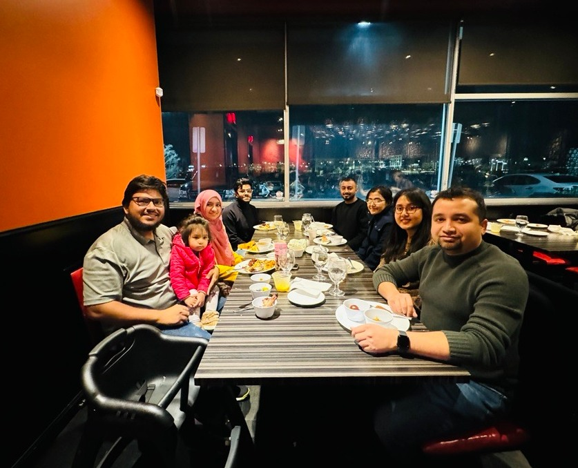

# Welcome to iSET Lab

The iSET Lab's commitment is to explore intelligent systems and emerging technologies that shape the future of various industries (e.g., civil engineering and construction) while encompassing the diverse research areas it covers. To pursue the long-term interdisciplinary research vision of future workforce development and digital twin towards a more sustainable and resilient civil/construction industry, iSET Lab will focus on multidisciplinary solutions informed by data science, AI (ML/DL), HPC, BIM, human factors engineering, drone technology, wearable devices, signal processing, and VR/AR.

The director of iSET Lab, Dr. Md Nazmus Sakib, is an Assistant Professor of Construction Engineering and Management in the Department of Civil Engineering at The University of Texas at Arlington.

---
 

  

---

## **News**  
### **Latest Updates from iSET Lab**  
📢 **[News Item 1]** - Brief description of recent achievement, project, or event.  
📢 **[News Item 2]** - Another key update regarding the lab's work.  
📢 **[News Item 3]** - Highlighting a conference presentation, publication, or grant.  

For more updates, stay connected with us!  

---