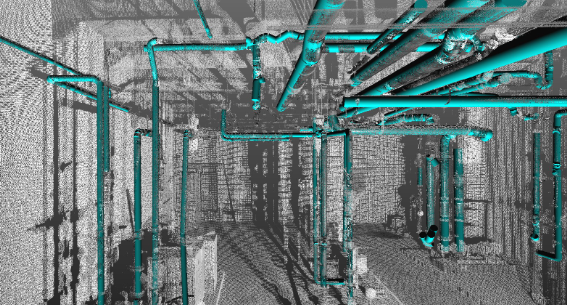

<!-- Inline CSS for demonstration; consider moving this into your main stylesheet -->

<!-- Use markdown="1" so that Markdown inside the div is parsed correctly -->

<!-- Main heading is center-aligned -->
# Teaching
{: .center-text}

<!-- Centered banner image -->
{: .banner-image}

## CE/CM 5343: Advanced Building Information Modeling

### Semesters:
- Fall 2023
- Spring 2024
- Fall 2024
- Spring 2025

### Instructor:
- Md Nazmus Sakib, Ph.D.  
  - [Faculty Profile](https://www.uta.edu/academics/faculty/profile?username=sakibm)

### Teaching Assistant:
- Sanjay Acharjee

[Course Website](#) <!-- Replace # with the actual course link if available -->

